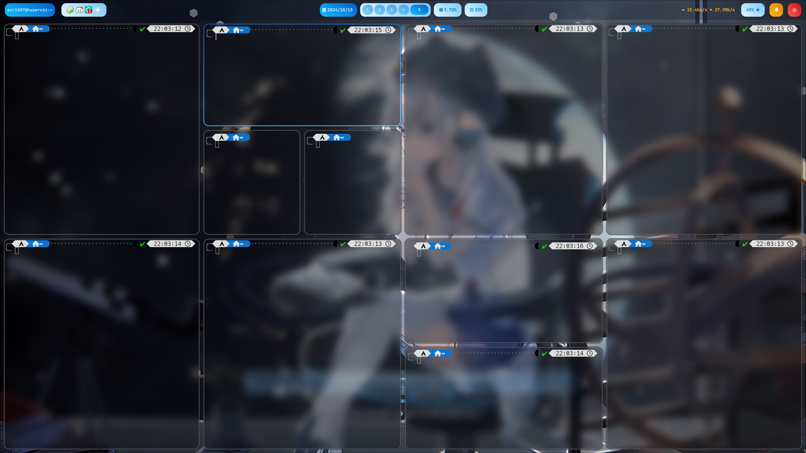

# Repository for my HyprDotfiles!
---
## I SURVIVED in Hyprland Civilization 🌎️
### Today I just finished my 🍚 of Hyprland💧, let me share it with you here! 😁
#### (but swaync haven't finished yet sorry 🥲

---

## Showcases!

- Playing music MV through Librewolf (This song is so gooood!)

- Lots of Kitty!

---

## For my wallpapers, they are located at the wallpaper/ folder in the root dir of this repository.

### Feel free to try them out! Both of they are my favourite wallpapers!

### Command to set the wallpaper g:

#### Wallpaper 1: Ilot from the Rhythm game, Rotateno:
<code>swww img ~/.wallpaper/rotaeno_ilot_x16_drawing.png</code>
 

#### Wallpaper 2: The wallpaper @end_4 used in the demo video on the [Hyprland](https://hyprland.org/) website:
<code>swww img ~/.wallpaper/hyprland_demo_x16_drawing.png</code>

## Special Credits 

- @UmmItC - For inviting and bringing me into the world of Arch Linux and Hyprland!

- [Hyprland](https://hyprland.org/) - For creating such beautiful, customizable tiling windows manager!

- [Arch Linux](https://archlinux.org/) - For the creation of such an amazing and fast OS for us community!
